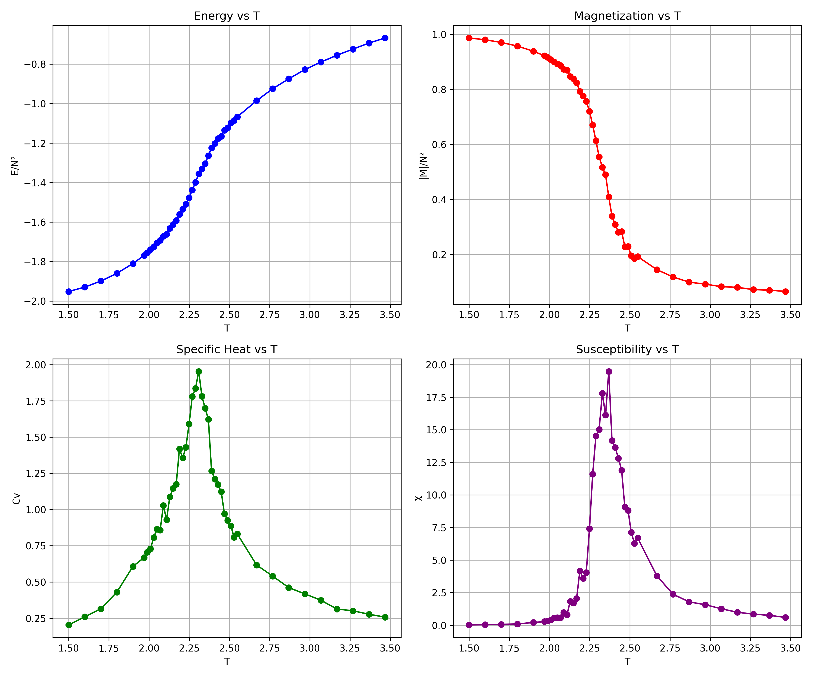

# 2D Ising Model Simulation

A Monte Carlo simulation of the 2D Ising model using the **Metropolis algorithm**, implemented in C++ with Python-based visualization.

Simulates a 2D lattice of magnetic spins and computes thermodynamic observables across a range of temperatures — capturing the **ferromagnetic phase transition** near the theoretical critical temperature *Tc ≈ 2.269* (in units of J/k_B).

---

## Output



The plots show energy, magnetization, specific heat, and magnetic susceptibility as functions of temperature. The sharp peaks in Cv and χ near *T ≈ 2.269* clearly mark the **second-order phase transition**.

---

## Features

- Supports **ferromagnetic** (J = +1) and **antiferromagnetic** (J = −1) coupling
- Supports **periodic** and **free** boundary conditions
- Adaptive temperature grid with **finer resolution near Tc** for accurate peak detection
- Outputs: energy per spin, magnetization per spin, specific heat (Cv), magnetic susceptibility (χ)
- Estimates Tc from peaks of Cv and χ

---

## How to Run

> Both files must be in the **same directory**.

**Step 1 — Compile and run the C++ simulation:**
```bash
g++ -O2 -o ising Ising_model_main.cpp
./ising
```
This generates `ising_results_ferro_PB.txt` (or similar, depending on parameters).

**Step 2 — Plot the results:**
```bash
python Ising_Model_Plotting.py
```
This reads the output file and saves `ising_thermo.png`.

---

## Parameters (in `Ising_model_main.cpp`)

| Parameter | Default | Description |
|-----------|---------|-------------|
| `N` | 30 | Lattice size (N × N) |
| `J` | +1.0 | Coupling constant (+1 ferro, −1 anti-ferro) |
| `FREE_BC` | false | Boundary condition (false = periodic) |
| `eq_steps` | 5000 | Equilibration sweeps |
| `measure_steps` | 20000 | Measurement sweeps |

---

## Tech Stack

- **C++** — Metropolis Monte Carlo engine, thermodynamic calculations
- **Python** — Data loading and plotting (`numpy`, `matplotlib`)

---

## Physics Background

The **2D Ising model** is a foundational model in statistical mechanics. Each lattice site holds a spin *s = ±1*, and the Hamiltonian is:

**H = −J Σ sᵢsⱼ**

where the sum runs over nearest-neighbor pairs. The model exhibits a **spontaneous symmetry breaking** below the critical temperature — spins align, producing net magnetization. Above Tc, thermal fluctuations destroy long-range order.

The **Metropolis algorithm** stochastically samples spin configurations according to the Boltzmann distribution, making it an efficient approach for systems where exact enumeration is computationally infeasible.
